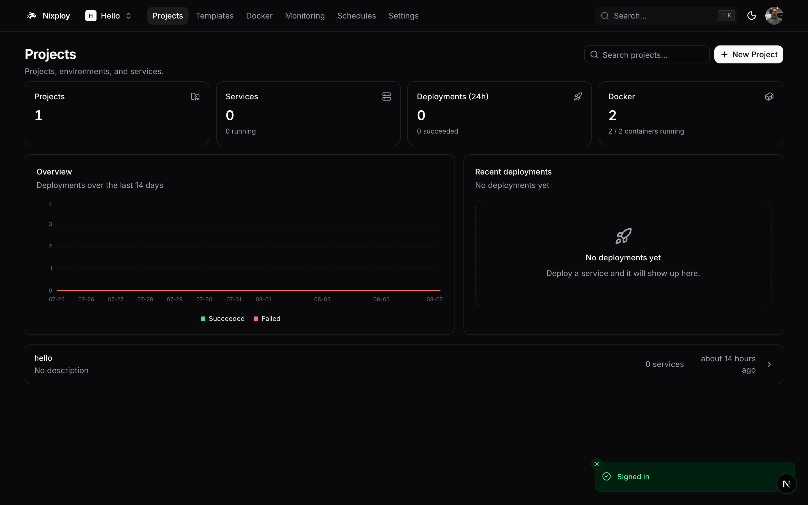
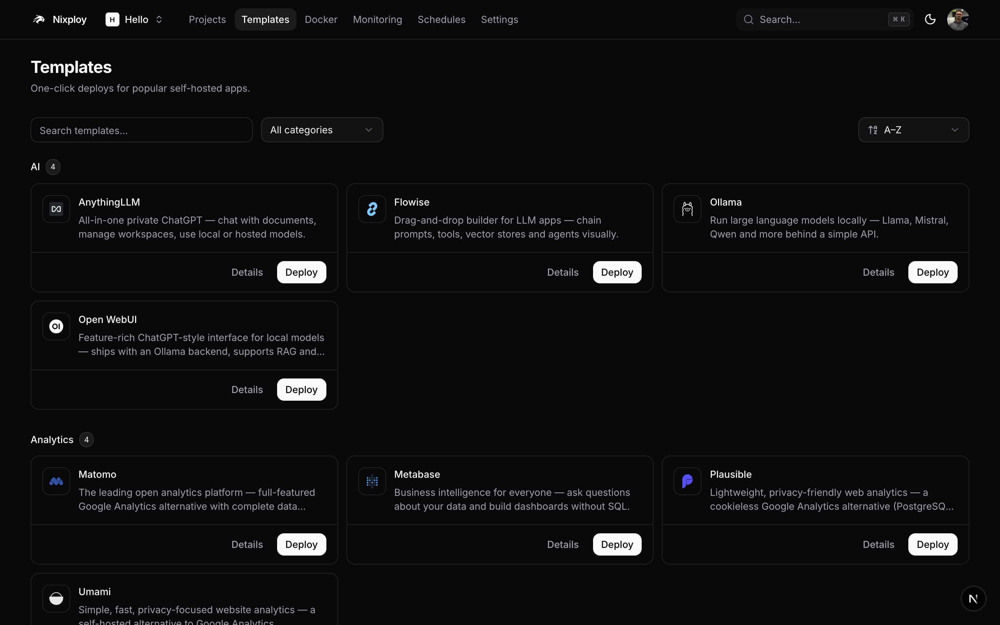
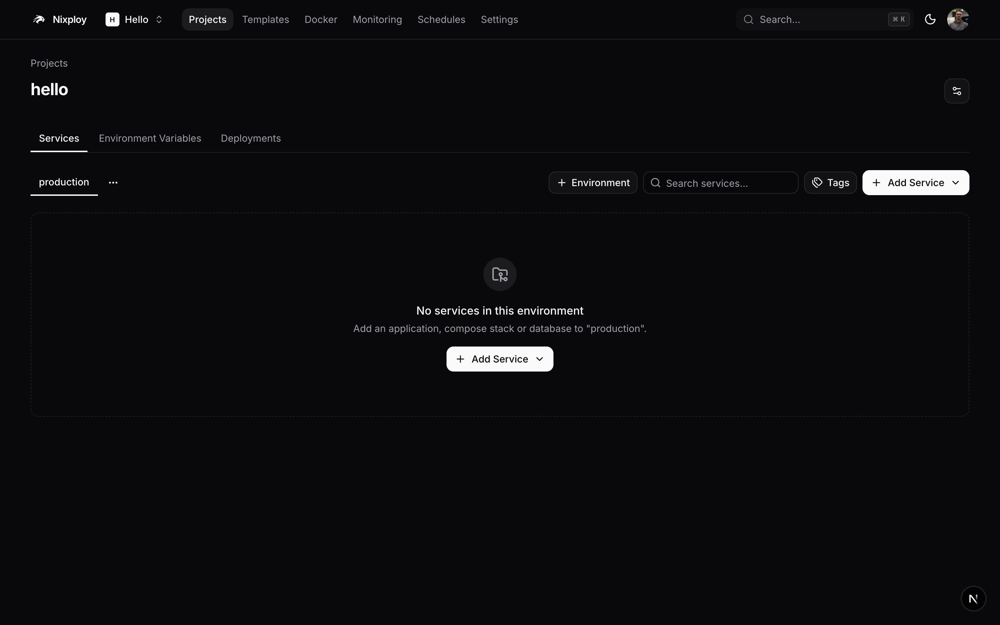
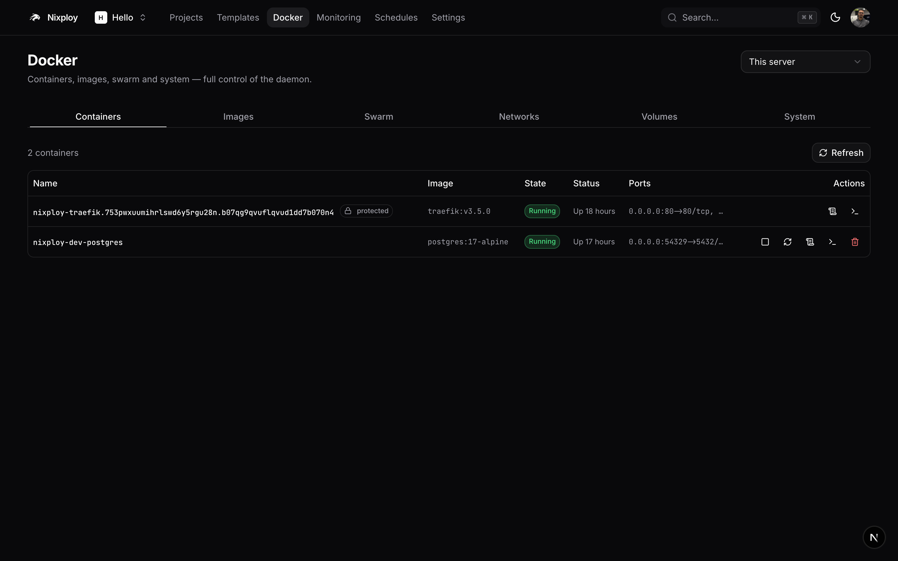
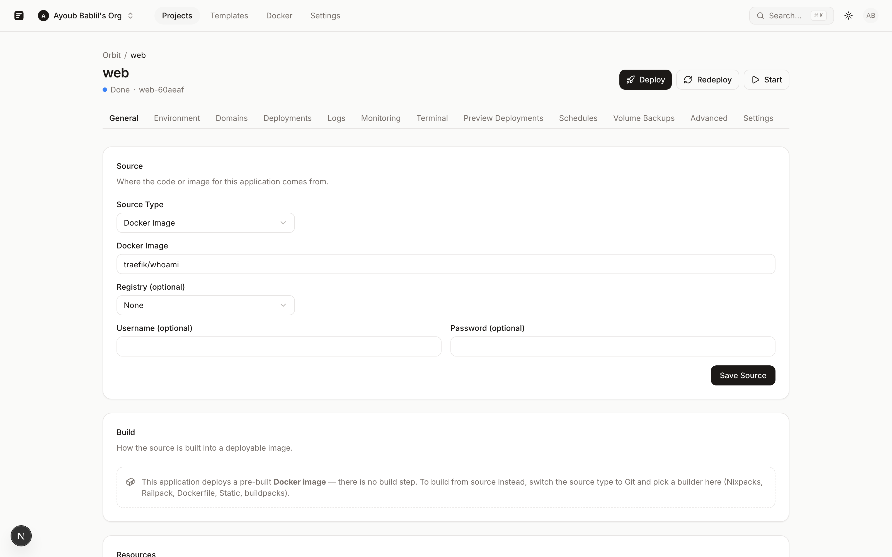
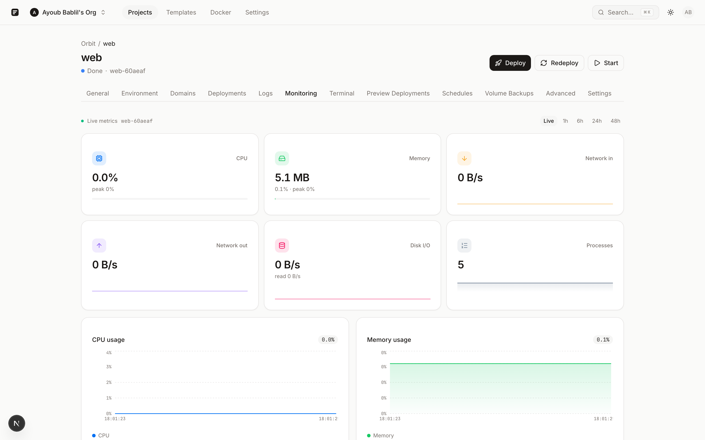

# Nixploy

<p align="center">
  
</p>

**Ship anything. Own everything.**

Nixploy is a free, self-hostable Platform as a Service. Deploy applications, databases, and Docker Compose stacks on infrastructure you control — with Git deploys, Traefik TLS, monitoring, and a first-class CLI.

**Website:** [nixploy.com](https://nixploy.com) · **GitHub:** [bablilayoub/nixploy](https://github.com/bablilayoub/nixploy)


## Install

```bash
curl -fsSL https://raw.githubusercontent.com/bablilayoub/nixploy/main/install.sh | sudo bash
```

With a domain (point DNS first):

```bash
NIXPLOY_DOMAIN=panel.example.com NIXPLOY_LETSENCRYPT_EMAIL=you@example.com \
  curl -fsSL https://raw.githubusercontent.com/bablilayoub/nixploy/main/install.sh | sudo bash
```

Full installer options: [`docs/install.md`](./docs/install.md). Update with [`update.sh`](./update.sh).

## Features

| Area | What you get |
| --- | --- |
| **Deploy** | Git providers, Docker images, zip uploads · Nixpacks / Dockerfile / buildpacks / static · PR previews · rollbacks |
| **Data** | Postgres, MySQL, MariaDB, MongoDB, Redis · scheduled S3-compatible backups |
| **Compose** | Native Compose / Swarm stacks with domains and logs |
| **Edge** | Traefik routing + Let's Encrypt TLS |
| **Observe** | Live metrics, log streaming, alerts, web terminal |
| **Team** | Orgs & roles, audit log, notifications, quotas |
| **Automate** | REST API (`x-api-key`), `/swagger` on your panel, `@nixploy/cli`, GitOps (`nixploy.yaml`) |
| **Catalog** | 86+ one-click templates |

## Screenshots

<table>
  <tr>
    <td width="50%" align="center" valign="top">
      <strong>Dashboard</strong><br />
      
    </td>
    <td width="50%" align="center" valign="top">
      <strong>Templates</strong><br />
      
    </td>
  </tr>
  <tr>
    <td width="50%" align="center" valign="top">
      <strong>Project</strong><br />
      
    </td>
    <td width="50%" align="center" valign="top">
      <strong>Docker</strong><br />
      
    </td>
  </tr>
  <tr>
    <td width="50%" align="center" valign="top">
      <strong>Application</strong><br />
      
    </td>
    <td width="50%" align="center" valign="top">
      <strong>Monitoring</strong><br />
      
    </td>
  </tr>
</table>

## Architecture

A single Node.js process (Next.js with a custom server) plus two sibling containers on a single-node Docker Swarm:

```
┌──────────────────────── Host (Docker Swarm manager) ────────────────────────┐
│                                                                             │
│   ┌──────────────┐    ┌──────────────────┐    ┌────────────────────────┐    │
│   │   nixploy    │    │ nixploy-postgres │    │    nixploy-traefik     │    │
│   │  (Next.js :  │───▶│   (PostgreSQL)   │    │  (:80 / :443, ACME)    │    │
│   │   3000)      │    └──────────────────┘    └───────────▲────────────┘    │
│   └──────┬───────┘                                        │                 │
│          │ writes dynamic YAML ──▶ /etc/nixploy/traefik/dynamic/*.yml       │
│          │ dockerode / ssh2 ─────▶ docker service create|update             │
│          │                       (user apps, databases, compose stacks)     │
│                                                                             │
│   overlay network: nixploy-network                                          │
└─────────────────────────────────────────────────────────────────────────────┘
```

Remote servers join the primary Swarm over SSH. Details: [`docs/architecture.md`](./docs/architecture.md).

## Quick start (local development)

Prerequisites: **Node.js ≥ 22**, **pnpm ≥ 10**, **Docker**.

```bash
pnpm install

docker run -d --name nixploy-postgres \
  -e POSTGRES_USER=nixploy -e POSTGRES_PASSWORD=nixploy -e POSTGRES_DB=nixploy \
  -p 5432:5432 postgres:17-alpine

cp apps/web/.env.example apps/web/.env
# Set BETTER_AUTH_SECRET and ENCRYPTION_KEY (openssl rand -hex 32 each)

pnpm -F @nixploy/server db:migrate
cd apps/web && pnpm dev
```

Open <http://localhost:3000> and complete `/setup`. More: [`docs/development.md`](./docs/development.md) · [`docs/getting-started.md`](./docs/getting-started.md).

### CLI & API

```bash
npm i -g @nixploy/cli
nixploy auth login --url http://localhost:3000 --api-key nxlp_...
nixploy doctor
```

REST paths are `GET|POST /api/<router>.<procedure>` with an `x-api-key` header. Interactive docs: **`/swagger`** on your panel. Guide: [`docs/api.md`](./docs/api.md) · [nixploy.com/api](https://nixploy.com/api).

## Docs

| Guide | Link |
| --- | --- |
| Docs index | [`docs/README.md`](./docs/README.md) |
| Install | [`docs/install.md`](./docs/install.md) |
| Getting started | [`docs/getting-started.md`](./docs/getting-started.md) |
| REST API | [`docs/api.md`](./docs/api.md) |
| Migrate from Coolify | [`docs/migrate-from-coolify.md`](./docs/migrate-from-coolify.md) |
| Migrate from Dokploy | [`docs/migrate-from-dokploy.md`](./docs/migrate-from-dokploy.md) |
| Marketing site | [nixploy.com/docs](https://nixploy.com/docs) |

## Repository layout

| Path | Description |
| --- | --- |
| `apps/web` | Next.js panel — UI, tRPC, REST/OpenAPI, custom server |
| `apps/landing` | Marketing site ([nixploy.com](https://nixploy.com)) |
| `apps/cli` | `@nixploy/cli` |
| `packages/server` | Schema, auth, deploy engine, Traefik/Docker utils |
| `docker/` | Production Dockerfile, Traefik config |
| `install.sh` / `update.sh` | Production installer and updater |

## License

Apache-2.0
